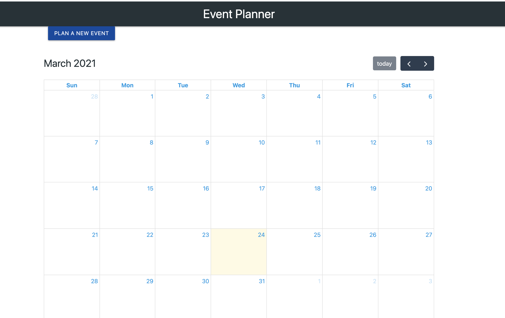
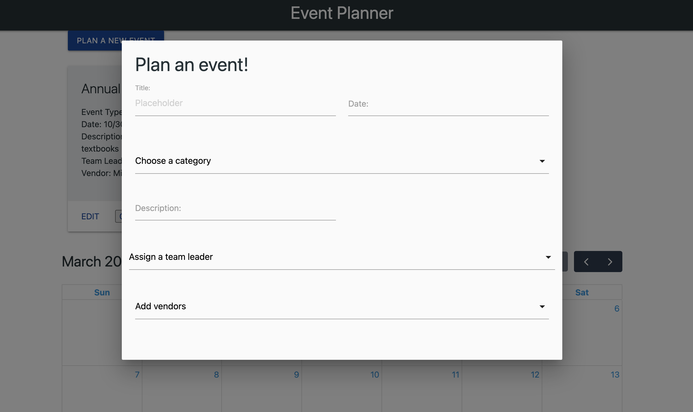
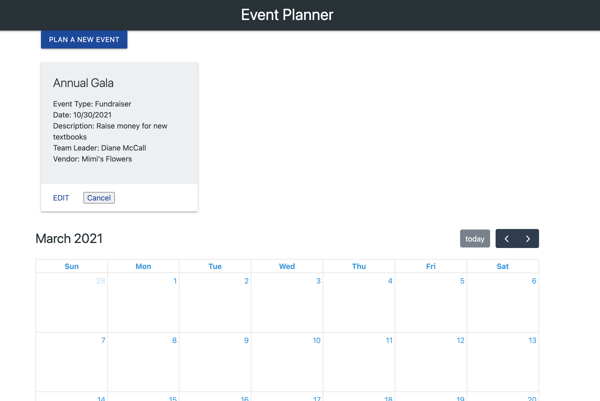

# Event Planner

# Table of Contents
1. [Project Description](#description)
2. [Usage](#usage)
3. [Dependencies](#dependencies)
4. [References](#references)
5. [Contributors](#contributors)

## Project Description 
This full-stack application utilizes the MVC paradigm and a server-side API.  Event Planner was designed to make it easier for members of a schoolboard to plan events and assign team leaders as well as vendors.  The user can fill out a form to schedule an event, and when submitted it is stored in a MySQL database.  Our original concept was beyond the scope of our team's knowledge.  With more time to develop this application we would add the following functionality:
- Events dynamically appear on the calender
- User can edit/cancel events
- Events would be color-coded by category
- Events could be flagged 'need attention' if vendors/team leaders needed to be assigned for the event to take place.
- User login/authentification for staff

## Usage 
- If running on local computer:\
From the command line, 
'npm run start'
In the browser:\
localhost:3000

- Deployed to Heroku:
[Event Planner](https://sheltered-plateau-08312.herokuapp.com/)

## Dependencies 
This application utilizes MySQL Workbench and requires the following npm packages:
- express
- mysql
- sequelize
- sequelize-cli
- eslint
- travis

## References 
[Sequelize Article](https://bezkoder.com/node-js-express-sequelize-mysql/)\
[Sequelize Video](https://www.youtube.com/watch?v=bOHysWYMZM0)

## Contributors 
Shauna Dunn\
Github username: [sleepytomatoes](https://github.com/sleepytomatoes)\
Email: shaunadunn1@gmail.com

Kiara Ferguson\
Github username: [kferguson1](https://github.com/kferguson1)\
Email: msfergk@gmail.com

Vanessa Patterson\
Github username: [vpatt1031](https://github.com/vpatt1031)\
Email: vpatt1031@gmail.com